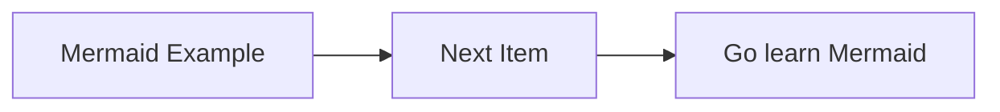
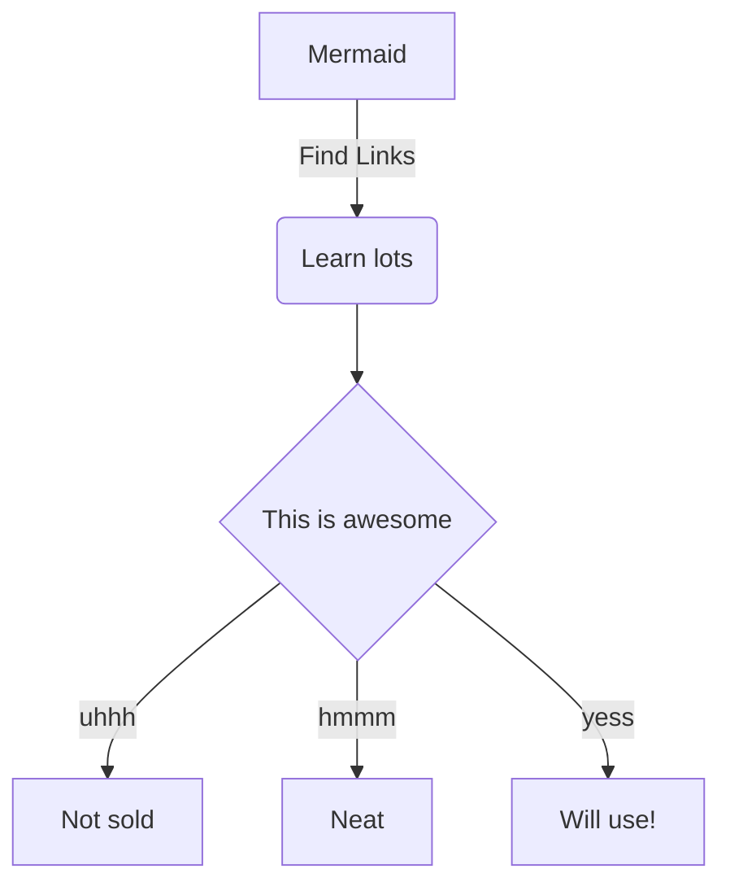

Nullam id dolor id nibh ultricies vehicula ut id elit. Vestibulum id ligula porta felis euismod semper. Lorem ipsum dolor sit amet, consectetur adipiscing elit. Etiam porta sem malesuada magna mollis euismod. Maecenas faucibus mollis interdum.

Vivamus sagittis lacus vel augue laoreet rutrum faucibus dolor auctor. Vestibulum id ligula porta felis euismod semper. Donec sed odio dui. Lorem ipsum dolor sit amet, consectetur adipiscing elit. Curabitur blandit tempus porttitor. Cum sociis natoque penatibus et magnis dis parturient montes, nascetur ridiculus mus. Donec id elit non mi porta gravida at eget metus.

Aenean lacinia bibendum nulla sed consectetur. Curabitur blandit tempus porttitor. Cras justo odio, dapibus ac facilisis in, egestas eget quam. Nullam id dolor id nibh ultricies vehicula ut id elit. Morbi leo risus, porta ac consectetur ac, vestibulum at eros. Duis mollis, est non commodo luctus, nisi erat porttitor ligula, eget lacinia odio sem nec elit.

## Code Block Examples

Simple Mermaid



Decision Tree



Grabbed some code fromt he Gatsby docs...

```javascript{numberLines: false}
exports.onCreateWebpackConfig = ({
  stage,
  rules,
  loaders,
  plugins,
  actions,
}) => {
  actions.setWebpackConfig({
    module: {
      rules: [
        {
          test: /\.less$/,
          use: [
            // We don't need to add the matching ExtractText plugin
            // because gatsby already includes it and makes sure its only
            // run at the appropriate stages, e.g. not in development
            loaders.miniCssExtract(),
            loaders.css({ importLoaders: 1 }),
            // the postcss loader comes with some nice defaults
            // including autoprefixer for our configured browsers
            loaders.postcss(),
            `less-loader`,
          ],
        },
      ],
    },
    plugins: [
      plugins.define({
        __DEVELOPMENT__: stage === `develop` || stage === `develop-html`,
      }),
    ],
  })
}
```